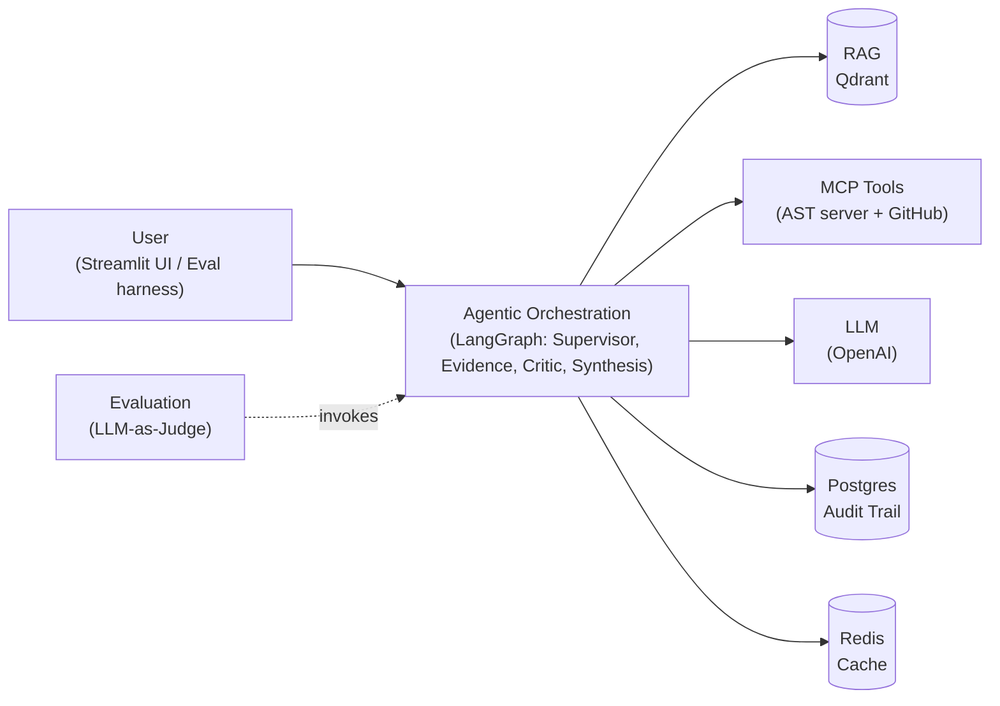

# AppMind — Documentation

*Application Knowledge & Decision Intelligence Agent — capstone submission documentation.*
*Design Doc: [`docs/onepager.md`](onepager.md) (submitted 2026-09-15, approved). Full build history: [`TASKS.md`](../TASKS.md) / [`FAILURES.md`](../FAILURES.md).*

---

## 1. Problem Statement

Teams that own applications depend on knowledge scattered across business documentation, architecture docs, source code, runbooks, and incident history — much of it implicit in a few experienced SMEs. Answering "why did this break," "how does this work," or "what would break if we changed X" well today means finding the right *person*, not the right system.

**AppMind** is an application-specific AI investigation agent that consolidates this scattered knowledge and investigates a question on the team's behalf, producing an evidence-backed, auditable decision brief — and escalating to a human when evidence is insufficient or contradictory. It is framed to *capture and scale SME judgment*, not replace it. The core differentiator, and the subject of the mandatory comparative evaluation, is a **Critic/Challenger agent** that reviews gathered evidence for contradictions, uncited claims, and gaps before an answer is allowed to ship.

**Scope**, deliberately narrow: one target application — **OrderFlow**, a synthetic order-processing service purpose-built for this capstone — and three question types: **Business/Functional**, **Incident/RCA**, and **Impact Analysis**.

### What changed since the Design Doc

The approved Design Doc (onepager) and the built system diverge in a few places, tracked honestly rather than silently:

- The onepager's "Use cases" section names *"Change-impact / will this fit review"* (evaluating a **proposed** future change against existing docs) as one of three illustrative scenarios. That was never built. **Incident/RCA** — investigating a **past**, real incident (INC-1001, a genuine duplicate-charge bug) — was built instead, and is a materially different capability: root-cause investigation, not compatibility review.
- The onepager's Success Metrics lists five metrics. Two — **Retrieval Recall@K** and **Escalation Accuracy** — were cut (CLAUDE.md's own priority list: "nice-to-have, cut first"). A weaker proxy, **Escalation Rate** (how *often* the system escalates, not whether escalation was *correct*), is reported instead.
- **FastAPI**, named in the onepager's tech stack, was dropped — the Streamlit UI calls the LangGraph pipeline in-process.
- **"Tickets"** and **"historical decisions"**, both named as potential knowledge-base content in the onepager, were never built into the corpus.

None of this is scope creep discovered late — every item above is logged in `FAILURES.md` (#1, #20, #21) or `TASKS.md`'s Decisions log at the point it happened.

---

## 2. Data Processing

### Sources

| Domain | Location | Content | Access |
|---|---|---|---|
| `docs` | `knowledge-domains/docs/` | 3 files: architecture overview, business/functional requirements, operations runbook | RAG (Qdrant) |
| `incidents` | `knowledge-domains/incidents/` | 4 files, each planting a *different* kind of problem (see §5) | RAG (Qdrant) |
| Code (structure) | `orderflow-app/` | OrderFlow's 6-file Python source | Custom AST MCP server (local, static analysis) |
| Code (real text) | `github.com/PrabuRepo/orderflow-app` | Same source, hosted | GitHub MCP server (remote, per-file fetch for citations) |

Ingestion (`ingest/run_ingestion.py`) chunks each doc by heading, embeds with `text-embedding-3-small`, and loads into two separate Qdrant collections — kept separate rather than one flat index (see Trade-offs, §4). A relevance cutoff (cosine similarity ≥ 0.25, tuned against measured scores on this corpus) means an off-topic question yields **empty** retrieval rather than the least-bad chunks dressed up as evidence.

### Handling PII

All data in this project — OrderFlow itself, its documentation, its incident reports, and its source code — is **entirely synthetic**, purpose-built for this capstone. No real user, customer, or production data appears anywhere in the corpus, by construction. There is nothing to anonymize because nothing real was ever collected.

That said, the system defends against PII *appearing in a live question* (a real user pasting a real email or phone number into the question box): the input guardrail (below) detects and blocks it before any retrieval or LLM call runs.

### Guardrails

Both guardrails are real, verified checks — not placeholders:

- **Input guardrail**: three deterministic regex patterns (email, phone, SSN-shaped). A match blocks the question immediately — `blocked=True`, routed straight to an honest escalation brief, **before any retrieval or LLM cost is incurred** (`token_usage=0`, `llm_calls=0`). Off-topic questions are deliberately *not* filtered here: the existing empty-retrieval → `confidence_score=0.0` → escalate path already handles them correctly (verified by a dedicated fault-injection test), so a second, cruder keyword-based off-topic filter would only add false-positive risk for no real gain.
- **Output guardrail**: refuses to let a brief ship with zero citations unless it is honestly an escalation — replacing it with a safe fallback rather than just logging a warning. A confident, uncited answer is exactly the false-confidence failure mode this whole project exists to catch; the guardrail must not let one through even if every upstream node missed it.

---

## 3. System Design & Architecture

### High Level Architecture Diagram

A simplified, component-category view. For the detailed pipeline (node-by-node flow, `pipeline_mode` routing, the retry loop, exact tool sequencing), see [`detailed-flow-diagram.md`](detailed-flow-diagram.md).



**Reading it:** a user question (via the UI, or a question from the eval harness) enters the agentic orchestration layer — the LangGraph pipeline of Supervisor, Evidence, Critic, and Synthesis agents. That layer is the hub: it pulls application knowledge from RAG (Qdrant), pulls code knowledge through MCP tools (the custom AST server and GitHub), makes its reasoning calls through the LLM, and persists results to Postgres (audit trail) and Redis (repeat-question cache). Evaluation sits outside this live path entirely — it invokes the same orchestration layer the way a real user would, then scores the result with an LLM-as-Judge.

### Pipeline

```
input_guardrail → supervisor → research → retriever → evidence → critic
  → confidence_gate → (escalate | synthesis) → output_guardrail → memory_write
```

Built as a single **LangGraph** `StateGraph`, not three separate systems. One flag — `pipeline_mode` — decides which nodes execute for a given run:

| Mode | Path |
|---|---|
| `baseline` | retrieve → answer directly (no evidence/critic/gate) |
| `critic_off` | full path, critic node skipped |
| `critic_on` | full path, including the critic — "AppMind proper" |

A retry loop (critic → research, capped at `retry_count < 2`) lets the Critic send a run back for another look when it finds an unresolved gap or contradiction — widening the search on each pass rather than repeating the same narrow query.

### Retrieval Design

**RAG** (Qdrant) covers `docs` and `incidents` — two collections, not one flat index, so each can have its own top-k policy per question type. **Code is deliberately not in the vector store.** "What depends on X" is a graph-traversal question with one correct answer, not a similarity-search problem — an embedded snapshot of code also goes silently stale the moment the code changes, which is precisely the kind of false confidence this project exists to catch.

Two MCP servers cover code, doing genuinely different jobs:

- **Custom AST server** (`mcp_servers/ast_server.py`) — a 4-pass static analysis (definitions → imports → type bindings → call resolution) over the local `orderflow-app/` checkout, exposing `list_components`/`get_dependents`/`get_callers`. Deliberately **offline**: building a cross-file dependency graph needs every file parsed together, not fetched one-at-a-time over a network API — the same reason real static-analysis tools (CodeQL, SonarQube) clone a repo and analyze the checkout rather than call a per-file API during analysis. 14/14 tests passing.
- **GitHub MCP** (`mcp_clients/github_client.py`) — the remote, official GitHub MCP server (`api.githubcopilot.com/mcp/`, written in Go), fetching one file's real text on demand for citation-grade evidence. Used only for `incident_rca` questions, where quoting the actual bug (not just a structural fact) is the clear payoff — e.g. citing `payment_client.py`'s literal "no idempotency key sent to the gateway" line for INC-1001. 11/11 tests passing against the real remote server.

### Orchestration

- **Supervisor**: classifies the question into one of the three build-scope types and, for `impact_analysis`/`incident_rca`, guesses a starting code component (a keyword stub — explicitly not the polished part of this build).
- **Evidence agent**: extracts claims with verbatim quotes; each quote is mechanically checked against the source chunk's real text (`is_grounded()`) — grounding is verified in code, never trusted from the model.
- **Critic agent**: reviews evidence for contradictions, uncited claims, and gaps, using a deliberately generic prompt that never names a specific planted incident — so the eval measures real judgement, not a critic tuned to the test corpus.
- **Confidence gate**: a heuristic score (starts at 1.0, penalized per unresolved flag and ungrounded citation, capped at 0.4 on any retrieval/agent error, forced to 0.0 on zero evidence) — below 0.5, or with any unresolved flag, the run escalates instead of answering.

### Framework justification

| Framework | Why |
|---|---|
| **LangGraph** | Explicit, inspectable state machine — the conditional routing `pipeline_mode` needs (3 different paths through one graph) and the Critic→Research retry loop are exactly what it's built for. |
| **Pydantic** | Every inter-node payload (evidence, critique flags, decision brief) is a validated schema, not a loose dict — a malformed field fails immediately instead of drifting silently downstream. |
| **MCP SDK** | One standard protocol for both code-access tools (custom AST + GitHub), with a real, testable failure mode ("the tool server is down") distinct from a RAG source being down. |
| **Qdrant** | Vector search for `docs`/`incidents`, run locally via Docker. |
| **PostgreSQL** | The `investigations` audit trail — one row per completed run, written by `memory_write`, never blocking the graph on failure. |
| **Redis** | An investigation-lookup cache (`memory/cache.py`), keyed on `(normalized question, pipeline_mode)` — repurposed from the onepager's "session state" framing into a repeat-question cache. Deliberately never touched by the eval harness, which must measure a fresh run every time. |
| **Streamlit** | Single-page UI, calls the graph in-process — no separate FastAPI layer (dropped from the original plan; nothing in the actual build needs a network hop between UI and pipeline). |
| **OpenAI (`gpt-5.4-mini`) + Docker** | LLM calls and local infrastructure (Postgres/Qdrant/Redis), respectively. |

---

## 4. Trade-offs

**Agentic latency/cost vs. RAG baseline.** `critic_on` costs roughly **7× the tokens and 4× the latency** of `baseline` (9,367 vs. 1,294 mean tokens; 14.7s vs. 3.8s mean latency — see §5) for a measurable gain in error-catch rate. Whether that trade is worth it depends entirely on how costly a wrong answer is in the target domain — this project takes the position that it is, for investigation questions specifically.

**Per-domain collections vs. flat index.** `docs` and `incidents` are separate Qdrant collections, each with its own top-k policy per question type, rather than one flat index — evaluated on 2 domains, not the originally-planned 3 (`tickets` was cut for time, `FAILURES.md` #1). More domains would strengthen the "many source types" story at the cost of build time this capstone didn't have.

**Retry cap vs. resolution completeness.** The Critic can be *over*-cautious, not just under-cautious. On both the Impact Analysis demo question (D3) and a business/functional backing question (B6) — one designed to have a clean, confident answer — `critic_on` escalated instead of answering, even though `baseline`/`critic_off` answered correctly. The retry cap (`< 2`) exists to bound cost, but it doesn't guarantee the Critic resolves its own doubts within that budget — a real cost of the design, not a bug.

**Remote GitHub MCP + PAT scoping vs. local Docker.** The GitHub MCP integration connects to GitHub's remote-hosted server rather than running `ghcr.io/github/github-mcp-server` locally — zero new infrastructure, and the read-only safety a local server's `--read-only` flag would give is achieved identically by scoping the PAT itself to read-only "Contents" access, enforced by GitHub server-side. The local-Docker path remains a deliberate, sequenced-later option, not a rejected one.

**Local AST checkout vs. a fully MCP-native structural analysis.** The custom AST server depends on a local `orderflow-app/` checkout, not a remote fetch — the right call for cross-file graph analysis (see §3), but a real, demonstrated fragility: a manual repo migration silently dropped this folder mid-project, breaking two capabilities at once until caught by the test suite (`FAILURES.md` #20). A fully GitHub-MCP-native version (fetch every file, then parse) would remove that fragility at the cost of materially more complexity and per-analysis latency — deliberately deferred, not built.

---

## 5. Evaluation

### Methodology

The mandatory comparative evaluation runs all **9 dataset questions** (3 demo — one per required type — plus 6 backing questions, covering all 4 planted corpus traps: INC-1001 a real code-verifiable bug, INC-1002 a false alarm, INC-1003 mundane filler, INC-1004 a doc-vs-doc contradiction) through **all 3 `pipeline_mode`s** — 27 graph runs, 1 trial each. Scoring: an LLM-as-judge (`llm_as_judge/judge.py`) for subjective questions, plus a **deterministic**, zero-cost check for the 2 Impact Analysis questions — comparing the answer text directly against the AST server's own `get_dependents()` output, no LLM judgment involved.

### Results (latest run, GitHub MCP active)

| Metric | baseline | critic_off | critic_on |
|---|---|---|---|
| False-confidence rate | 0.429 | 0.143 | 0.286 |
| Error-catch rate (planted traps) | 0.5 | 0.75 | **0.75** |
| Citation accuracy (LLM judge) | 0.774 | 0.816 | 0.828 |
| Citation grounding rate (mechanical) | — | 0.981 | 1.0 |
| Escalation rate | 0.0 | 0.0 | 0.444 |
| Mean tokens / mean latency | 1,294 / 3.8s | 2,542 / 5.1s | 9,367 / 14.7s |

Error handling: **4/4** fault-injection cases pass (dead MCP server, hung MCP server, Qdrant unreachable, empty/off-topic retrieval) — every failure degrades to an honest escalation, never a crash.

### A finding worth stating plainly, not smoothing over

This is the **second** eval run this session. The first (before the GitHub MCP integration) showed `critic_on` with the *lowest* false-confidence rate of the three (0.143) — the clean headline result. This run shows `critic_on` at 0.286, *higher* than `critic_off`. Pulling the judge's actual reasoning rather than trusting the aggregate number:

- One flagged case (B6, a question designed to have a confident correct answer) is the Critic's *over-caution* failure mode, not under-caution — the judge's own words: "overly cautious... defers instead of giving the documented confident conclusion." Scored under `false_confidence`, but the opposite problem.
- The other (B5, a refund-hallucination trap) was caught by `critic_on` in the first run and missed in this one — single-trial LLM sampling variance, not a system change.

**Error-catch rate is stable across both runs (0.75); false-confidence rate is not.** With only 1 trial per question, that instability is expected, not evidence of a broken system — but it means the false-confidence numbers above should be read as directional, not final. `evals/run_eval.py --trials N` exists specifically to produce a stable version of this number; it was not run before this submission given time constraints.

Two metrics from the original Design Doc — **Retrieval Recall@K** and **Escalation Accuracy** — are not implemented (cut deliberately, stated here rather than silently omitted). Impact Analysis component recall (deterministic, AST-verified) is reported as a narrower, verifiable substitute for the two Impact Analysis questions specifically.

---

## 6. Failure Analysis

Logged as they happened throughout the build (`FAILURES.md`, 21 entries) — highlights below, not a full reproduction:

- **Scope cut**: the planned `tickets` RAG domain was dropped entirely to protect build time (#1).
- **Architecture pivot**: the original plan specified the GitHub MCP server; OrderFlow initially had no real hosted repo, so the Filesystem MCP server was substituted — then reversed again once `orderflow-app/` was genuinely pushed to GitHub, reviving the original GitHub MCP plan for real code citations.
- **Windows encoding bug**: `Path.read_text()`'s default cp1252 encoding corrupted every em dash across the ingested corpus — caught by eyeballing retrieval output, not an automated check, since ranking still looked correct (#3).
- **`baseline` mode originally did no retrieval at all** — a strawman that would have overstated the Critic's benefit; fixed by giving every mode the same first-pass retrieval (#7).
- **The Critic's non-determinism on INC-1001 is not a bug** — four identical runs of the same question produced three correct escalations and one false-confidence answer, with no code change between them. This *is* the false-confidence-rate metric; the project's stance is to measure the rate across many trials, not eliminate the variance with a single hand-tuned prompt (#11).
- **The Critic can be over-cautious, not just under-cautious** — first found on an Impact Analysis question (#13), confirmed again this session on a business/functional one (§5) — a genuine, two-sided cost of the design, not a one-off.
- **A stray Streamlit process was silently running on the wrong Python interpreter for hours** — rendered correctly (the global environment happened to have the same packages) while writing nowhere verifiable; found only by checking a database row directly rather than trusting the UI's own success (#16).
- **PII handling and the input/output guardrails were non-functional stubs until this session** — found via a direct rubric cross-check against the actual code (not assumed from the docstrings describing what they *should* do), then given a real, minimal implementation (#19-adjacent Decisions log entry).
- **A manual repo migration silently dropped the `orderflow-app/` folder entirely**, breaking both Impact Analysis and Incident RCA's GitHub code-read as a side effect — caught by an unrelated regression run, not a targeted check (#20).

---

## 7. Conclusion

The evaluation supports a qualified, not absolute, version of the project's thesis. **Error-catch rate is a clean, stable win for the Critic** — 0.75 vs. 0.5 (baseline/critic_off) in both runs — the Critic reliably catches more of the planted traps than either alternative. **False-confidence rate is directionally favorable but not yet stable** across a single trial per question; the same run that confirms the error-catch advantage also shows the Critic can swing from best-of-three to worst-of-three on this specific metric between runs, and can itself fail in the opposite direction (over-caution) on questions where a confident answer was correct and available. Both costs are real: ~7× the tokens and ~4× the latency of a plain RAG baseline.

That instability is itself evidence the evaluation is measuring something real rather than reporting a rehearsed demo number — a system honest enough to show its own variance, rather than average it away, is closer to the auditable, escalate-when-uncertain behavior this project set out to build in the first place.
