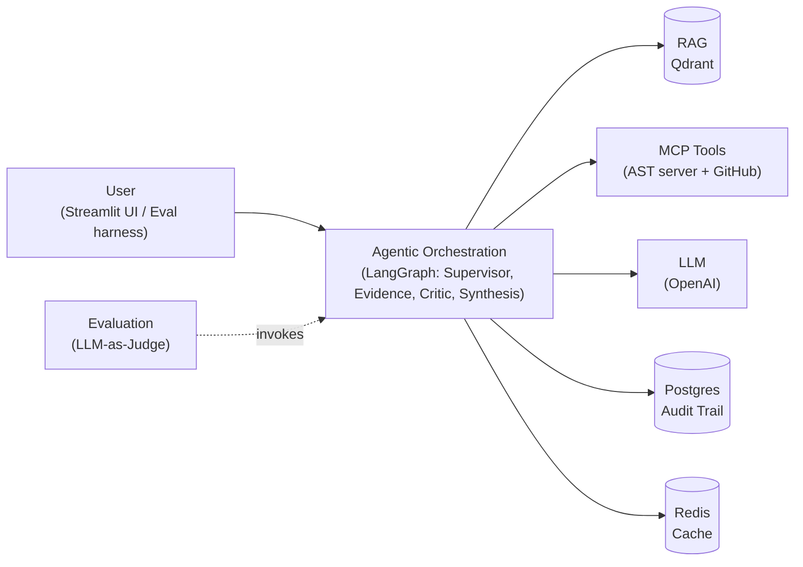

# AppMind — Documentation

*Application Knowledge & Decision Intelligence Agent — capstone submission documentation.*
*Design Doc: [`docs/onepager.md`](onepager.md) (submitted 2026-09-15, approved). Full build history: [`TASKS.md`](../TASKS.md) / [`FAILURES.md`](../FAILURES.md).*

---

## 1. Problem Statement

Teams that own applications depend on knowledge scattered across business documentation, architecture docs, source code, runbooks, and incident history — much of it implicit in a few experienced SMEs. Answering "why did this break," "how does this work," or "what would break if we changed X" well today means finding the right *person*, not the right system.

**AppMind** is an application-specific AI investigation agent that consolidates this scattered knowledge and investigates a question on the team's behalf, producing an evidence-backed, auditable decision brief — and escalating to a human when evidence is insufficient or contradictory. It is framed to *capture and scale SME judgment*, not replace it. The core differentiator, and the subject of the mandatory comparative evaluation, is a **Critic/Challenger agent** that reviews gathered evidence for contradictions, uncited claims, and gaps before an answer is allowed to ship.

**Scope**, deliberately narrow: one target application — **OrderFlow**, a synthetic order-processing service purpose-built for this capstone — and three question types: **Business/Functional**, **Incident/RCA**, and **Impact Analysis**.

### What changed since the Design Doc

The approved Design Doc (onepager) and the built system diverge in a few places, tracked honestly rather than silently:

- The onepager's "Use cases" section names *"Change-impact / will this fit review"* (evaluating a **proposed** future change against existing docs) as one of three illustrative scenarios. That was never built. **Incident/RCA** — investigating a **past**, real incident (INC-1001, a genuine duplicate-charge bug) — was built instead, and is a materially different capability: root-cause investigation, not compatibility review.
- The onepager's Success Metrics lists five metrics. Two — **Retrieval Recall@K** and **Escalation Accuracy** — were cut (CLAUDE.md's own priority list: "nice-to-have, cut first"). A weaker proxy, **Escalation Rate** (how *often* the system escalates, not whether escalation was *correct*), is reported instead.
- **FastAPI**, named in the onepager's tech stack, was dropped — the Streamlit UI calls the LangGraph pipeline in-process.
- **"Tickets"** and **"historical decisions"**, both named as potential knowledge-base content in the onepager, were never built into the corpus.

None of this is scope creep discovered late — every item above is logged in `FAILURES.md` (#1, #20, #21) or `TASKS.md`'s Decisions log at the point it happened.

---

## 2. Data Processing

### Sources

| Domain | Location | Content | Access |
|---|---|---|---|
| `docs` | `knowledge-domains/docs/` | 3 files: architecture overview, business/functional requirements, operations runbook | RAG (Qdrant) |
| `incidents` | `knowledge-domains/incidents/` | 4 files, each planting a *different* kind of problem (see §5) | RAG (Qdrant) |
| Code (structure) | `github.com/PrabuRepo/orderflow-app`, indexed to Postgres | OrderFlow's 6-file Python source: dependency/call graph | Custom AST MCP server over a code snapshot (static analysis done ahead of time by the `indexer/` project) |
| Code (real text) | Same snapshot (`code_files`) | The source files, verbatim, tagged with the commit SHA | Read from the code index for citations; no repository access at question time |

Ingestion (`ingest/run_ingestion.py`, folders taken from the application profile) chunks each doc by heading, embeds with `text-embedding-3-small`, and loads into two separate Qdrant collections — kept separate rather than one flat index (see Trade-offs, §4). A relevance cutoff (cosine similarity ≥ 0.25, tuned against measured scores on this corpus) means an off-topic question yields **empty** retrieval rather than the least-bad chunks dressed up as evidence.

### Handling PII

All data in this project — OrderFlow itself, its documentation, its incident reports, and its source code — is **entirely synthetic**, purpose-built for this capstone. No real user, customer, or production data appears anywhere in the corpus, by construction. There is nothing to anonymize because nothing real was ever collected.

That said, the system defends against PII *appearing in a live question* (a real user pasting a real email or phone number into the question box): the input guardrail (below) detects and blocks it before any retrieval or LLM call runs.

### Guardrails

Both guardrails are real, verified checks — not placeholders:

- **Input guardrail**: two checks, in order. First, three deterministic regex patterns (email, phone, SSN-shaped) — a match blocks the question immediately, `blocked=True`, routed straight to an honest escalation brief, **before any retrieval or LLM cost is incurred** (`token_usage=0`, `llm_calls=0`). Second, a topic-relevance check: the question is embedded and compared via cosine similarity against a reference description of the application's scope (`scope.description` in the application profile), blocking anything below a threshold (0.18) chosen by measuring real on-topic vs. off-topic questions (see §3's Components details). This *replaced* an earlier design where off-topic questions were deliberately left unfiltered at input, relying only on the downstream empty-retrieval → `confidence_score=0.0` → escalate path — that path still exists as the fallback if the topic-check's own embedding call fails (fail-open, not fail-closed).
- **Output guardrail**: refuses to let a brief ship with zero citations unless it is honestly an escalation — replacing it with a safe fallback rather than just logging a warning. A confident, uncited answer is exactly the false-confidence failure mode this whole project exists to catch; the guardrail must not let one through even if every upstream node missed it.

---

## 3. System Design & Architecture

### High Level Architecture Diagram

A simplified, component-category view. For the detailed pipeline (node-by-node flow, `pipeline_mode` routing, the retry loop, exact tool sequencing), see [`detailed-flow-diagram.md`](detailed-flow-diagram.md).



**Reading it:** a user question (via the UI, or a question from the eval harness) enters the agentic orchestration layer — the LangGraph pipeline of Supervisor, Evidence, Critic, and Synthesis agents. That layer is the hub: it pulls application knowledge from RAG (Qdrant), pulls code knowledge through MCP tools (the custom AST server and GitHub), makes its reasoning calls through the LLM, and persists results to Postgres (audit trail) and Redis (repeat-question cache). Evaluation sits outside this live path entirely — it invokes the same orchestration layer the way a real user would, then scores the result with an LLM-as-Judge.

### Components details

Every box in the diagram above, and every piece that sits behind "Agentic Orchestration" — what it is, what it does, and how it actually works.

**Agentic Orchestration (LangGraph)**

What it is: a single **LangGraph** `StateGraph` — not three separate systems for baseline/critic_off/critic_on. How it works: one flag, `pipeline_mode`, decides which nodes execute for a given run, and a retry loop (critic → research, capped at `retry_count < 2`) lets the Critic send a run back for another look when it finds an unresolved gap or contradiction, widening the search on each pass rather than repeating the same narrow query.

```
input_guardrail → supervisor → research → retriever → evidence → critic
  → confidence_gate → (escalate | synthesis) → output_guardrail → memory_write
```

| Mode | Path |
|---|---|
| `baseline` | retrieve → answer directly (no evidence/critic/gate) |
| `critic_off` | full path, critic node skipped |
| `critic_on` | full path, including the critic — "AppMind proper" |

Four pieces of that pipeline do the actual reasoning/decision work:

- **Supervisor** — *what:* the classification step. *Functionality:* sorts the question into one of the three build-scope types and, for `impact_analysis`/`incident_rca`, guesses a starting code component. *How it works:* a keyword stub today (checks for words like "affect"/"depend"/"charge"), not an LLM call — explicitly not the polished part of this build. The component guess is not hardcoded: it comes from the `scope.aliases` of the application profile (`config/apps/<id>.yaml`).
- **Evidence agent** — *what:* the claim-extraction step. *Functionality:* turns retrieved chunks into structured, cited claims. *How it works:* one LLM call extracts claims with verbatim quotes, then code mechanically checks each quote against the source chunk's real text (`is_grounded()`) — grounding is verified, never trusted from the model.
- **Critic agent** — *what:* the challenge/review step, and the whole point of the comparative eval. *Functionality:* reviews evidence for contradictions, uncited claims, and gaps. *How it works:* one LLM call with a deliberately generic prompt that never names a specific planted incident, so the eval measures real judgement rather than a critic tuned to the test corpus; flags are sticky across retries (an earlier flag stays unresolved unless the model explicitly says the current evidence resolves it).
- **Confidence gate** — *what:* the go/no-go decision. *Functionality:* decides whether an investigation is confident enough to answer, or should escalate. *How it works:* a heuristic score (starts at 1.0, penalized per unresolved flag and ungrounded citation, capped at 0.4 on any retrieval/agent error, forced to 0.0 on zero evidence) — below 0.5, or with any unresolved flag, the run escalates instead of answering.

**RAG (Qdrant)**

What it is: vector search over two Qdrant collections, `docs` and `incidents` — not one flat index, so each can have its own top-k policy per question type. Functionality: retrieves the documentation/incident chunks most relevant to a question. How it works: the question is embedded (`text-embedding-3-small`) and compared by cosine similarity, with a relevance cutoff (0.25, measured against this corpus) so an off-topic question yields empty retrieval rather than the least-bad chunks dressed up as evidence. **Code is deliberately not in the vector store** — "what depends on X" is a graph-traversal question with one correct answer, not a similarity-search problem, and an embedded snapshot of code goes silently stale the moment the code changes.

**Code knowledge (indexer + code index + custom AST MCP server)**

Code is **indexed ahead of time and read from AppMind's own store at question time**; answering a question never contacts GitHub or a local checkout (design: [`features/code-index/code-index-design.md`](../features/code-index/code-index-design.md)). Three pieces:

- **Application profile** (`app_profile/`, `config/apps/<id>.yaml`) — what: the one file that says which application AppMind serves and where its knowledge lives. Functionality: lists code repositories, docs and incident folders, and optionally a topic description and component aliases; ingestion, the topic guardrail, the supervisor and the indexer all read it, and the agent prompts and UI take the application's name from it, so a new application is a new file, not a code change. How it works: a strict loader validates the YAML against a JSON Schema (unknown keys and inline secrets are rejected, secrets are env-var names only) and returns a frozen model; the indexer, which must not import AppMind, receives it as a generated `targets.toml`. Design: [`features/appmind-config/`](../features/appmind-config/app-config-design.md).
- **Indexer** (`indexer/`) — what: a self-contained batch project with its own Dockerfile, requirements and tests; it imports nothing from AppMind and is built to move to its own repository. Functionality: turns each code repository in the application profile (exported to a generated `targets.toml`) into a *snapshot*. How it works: resolves the branch to an immutable commit SHA, downloads that commit as a tarball into a temporary directory, runs a 4-pass static analysis (definitions → imports → type bindings → call resolution) to build the dependency/call graph, and writes the graph and the source files to Postgres in **one transaction per repository** (a failed run leaves the previous snapshot serving). An unchanged commit is skipped, so re-running is cheap. Its only interface with AppMind is a documented data contract (`indexer/CONTRACT.md`: the tables and a versioned graph JSON schema).
- **Code context** (`code_context/`) — what: AppMind's read-only view of that store, and the only AppMind code that knows the contract. Functionality: reads the current snapshot, checks its schema version (refusing an unsupported one rather than misreading it), rebuilds the graph for queries, and returns stored source text. A boundary test fails the build if AppMind and the indexer ever import each other.
- **Custom AST MCP server** (`mcp_servers/ast_server.py`) — what: the dependency-graph tool agents call. Functionality: exposes `list_components`/`get_dependents`/`get_callers` for Impact Analysis and Incident/RCA questions. How it works: loads a snapshot file exported from Postgres (so it never needs database credentials and never parses code), and answers from the graph deterministically. 14/14 tests passing over a real stdio MCP connection.

For `incident_rca` questions the same snapshot also supplies the real source text of the components the AST lookup resolved, so the evidence can cite the actual code (e.g. `payment_client.py`'s retry loop for INC-1001) with the citation naming the exact commit (`repo@sha`). The remote GitHub MCP client (`mcp_clients/github_client.py`) is kept as an optional live fallback but is no longer on the default path. Measured effect on that step: reading a cited file went from **~1,315 ms** (a remote GitHub round trip, repeated on every Critic retry) to **~22 ms** (a database read).

**LLM (OpenAI)**

What it is: every real reasoning and embedding call in the system, behind one wrapper (`app/llm.py::structured_call`, plus `rag/search.py::embed_query`). Functionality: chat completions for Evidence/Critic/Synthesis (and the eval's LLM-as-Judge), embeddings for RAG search and the input guardrail's topic-relevance check. How it works: `gpt-5.4-mini` by default (`text-embedding-3-small` for embeddings), swappable via `APPMIND_LLM_MODEL` with no code change; every call is Pydantic-schema-constrained (structured output, not "reply in JSON and hope") and never raises — a failure becomes a recorded error, not a crash.

**Storage (Postgres + Redis)**

- **Postgres** — what: the `investigations` audit trail. Functionality: one row per completed run (question, mode, confidence, tokens, latency, citations). How it works: written by `memory_write` at the end of every run; best-effort — a dead Postgres degrades to a printed warning, never a crash.
- **Redis** — what: an investigation-lookup cache (`memory/cache.py`). Functionality: lets a repeated question skip re-running the whole pipeline. How it works: keyed on `(normalized question, pipeline_mode)` — mode is part of the key deliberately, so a `critic_on` answer can never be served back for a `baseline` lookup — with a 24h TTL. `evals/run_eval.py` deliberately never goes through this path, so every eval run is measured fresh.

**Evaluation**

What it is: the mandatory comparative harness (`evals/`). Functionality: scores baseline/critic_off/critic_on against each other on the same questions. How it works: invokes the same Agentic Orchestration graph a real user would, from outside the live path, then scores results with an LLM-as-Judge plus a deterministic AST-based check for Impact Analysis — full detail in §5.

### End-to-end flow, from the Streamlit UI

Tracing an actual question through the real code, not a diagram:

**1. UI → entry point.** `ui/streamlit_app.py` submits the question to `investigate(question, PipelineMode.CRITIC_ON)` in `app/investigate.py` — the UI never calls the graph directly, and always runs `critic_on` (no mode selector yet, see §7's Housekeeping notes).

**2. Cache check, before anything else.** `investigate()` checks Redis first (`memory/cache.py`, keyed on normalized question + pipeline mode). A cache hit returns the previous `DecisionBrief` immediately — no graph run, no LLM calls, no cost. A miss builds/reuses the compiled LangGraph and invokes it with a fresh `GraphState`.

**3. The graph itself**, node by node (component category in brackets, using the same vocabulary as the High Level Architecture Diagram above):

- **input_guardrail** *[Guardrail]* — the PII regex check, then the topic-relevance embedding check (see §2's guardrails discussion). Either can short-circuit straight to `escalate` before any real cost is spent.
- **supervisor** *[Agent — orchestration, no LLM call yet]* — classifies question type and guesses a target component (keyword stub today, not the polished part of this build).
- **research** *[Orchestration logic]* — decides which Qdrant collections/top-k to use and whether AST/GitHub MCP tools are needed. Pure deterministic planning — no LLM call, no external system touched yet.
- **retriever** *[RAG + MCP + code index]* — embeds the question and vector-searches `docs`/`incidents` (RAG); for impact/incident questions also calls the AST MCP server over the current code snapshot, and for `incident_rca` attaches the real source text of the resolved components from the same snapshot (code index). It never contacts GitHub; the log and trace show which snapshot (`repo@sha`) the code evidence came from.
- **evidence** *[Agent — LLM]* — one LLM call extracts cited claims; each quote is mechanically checked against the source text, never trusted from the model.
- **critic** *[Agent — LLM]* — one LLM call reviews for contradictions, uncited claims, and gaps. If something is unresolved and `retry_count < 2`, the graph loops back to **research** with a wider search.
- **confidence_gate** *[Orchestration logic]* — the heuristic score described above. Deterministic, no LLM call.
- **fork** — confident enough with no open flags routes to **synthesis** *[Agent — LLM]* (one final LLM call writes the answer); otherwise to **escalate** *[Orchestration logic]* (no LLM call, an honest "can't answer").
- **output_guardrail** *[Guardrail]* — refuses to let an uncited, non-escalation answer ship.
- **memory_write** *[Storage — Postgres + Redis]* — writes the Postgres audit row, caches the result in Redis for next time, and prints the run's final `[trace]` / `llm_calls` / `token_usage` summary (see FAILURES.md and TASKS.md for the observability work that added this).

Note: **Eval** (the fourth category in the architecture diagram) never appears in this list — evaluation *invokes* this same graph from outside (see the diagram above) rather than being a node within it, so a single UI question never touches the eval harness.

**4. Back to the UI.** `investigate()` returns the `DecisionBrief`; Streamlit stores it in `st.session_state` and renders the answer (as a warning if escalated), a confidence progress bar, an expander explaining *why* it escalated when applicable, affected components (Impact Analysis only), and citations.

For a `critic_on` question that triggers one retry, the real logged trace looks like:
```
input_guardrail -> supervisor -> research -> retriever -> evidence -> critic
  -> research -> retriever -> evidence -> critic
  -> confidence_gate -> synthesis -> output_guardrail -> memory_write
```

### Eval Run Flow, from `python -m evals.run_eval`

Same graph as the Streamlit UI flow above, wrapped in an outer loop that runs it many times and scores each result — the differences from the UI flow are called out explicitly below rather than repeated.

**1. Entry point — bypasses the cache entirely.** `evals/run_eval.py`'s `main()` loops over all **[9 dataset questions](../evals/dataset.py)** × **3 pipeline modes** × `--trials` (default 1), calling `run_one()` for each. Unlike the UI, this calls `build_graph().invoke()` **directly** — never through `app/investigate.py` — so there is no Redis cache lookup. Every run is guaranteed fresh; a cache hit here would report near-zero cost/latency and silently erase the exact variance the harness exists to measure.

The 3 pipeline modes, briefly (full detail in Components details above):

| Mode | What it measures |
|---|---|
| `baseline` | Plain retrieve-then-answer, no Evidence/Critic/Gate — the RAG-only comparison point |
| `critic_off` | Full path minus the Critic — isolates what Evidence/grounding alone buys |
| `critic_on` | Full path including the Critic — "AppMind proper," what the eval is ultimately arguing for |

**2. The graph itself, node by node** — identical to the "End-to-end flow" section above: same `[Guardrail]`/`[Agent]`/`[RAG + MCP]`/`[Orchestration logic]`/`[Storage]` components, same retry loop, same routing by `pipeline_mode`. Nothing about the graph itself changes when it's invoked by the eval harness instead of the UI.

**3. Scoring, right after each run finishes** *(this step doesn't exist in the UI flow — it's eval-only)*:
- **Impact Analysis questions (D3, B4)** — scored **deterministically**, zero LLM cost: `check_impact_analysis()` calls the AST graph directly (in-process, not the MCP subprocess) and checks whether the answer text actually names the real dependent components.
- **Every other question** — one `judge_run()` call to the LLM-as-judge (`llm_as_judge/judge.py`), scoring false-confidence, whether the planted issue was caught, and citation accuracy. This judge cost is tracked **separately** from the pipeline's own `token_usage`, so it never inflates the reported per-mode cost.

**4. Record + repeat.** Each run's result (latency, tokens, llm_calls, confidence, escalated, citations, judge verdict) is appended to an in-memory list; the loop moves to the next (question, mode, trial) combination.

**5. Error-handling re-check**, after all graph runs finish (unless `--skip-error-cases`): re-runs the same 4 fault-injection cases from `app/test_research_retriever.py` — reused, not duplicated, so that logic exists in exactly one place.

**6. Aggregate + write results.** `aggregate_by_mode()` averages every metric per pipeline_mode, then writes two files:
- `evals/results/runs.jsonl` — every individual run, raw, one JSON object per line
- `evals/results/summary.md` — the aggregated table (mean latency/tokens, false-confidence rate, error-catch rate, citation accuracy, escalation rate, per mode) — this is where the numbers in §5 below come from

### Framework justification

| Framework | Why |
|---|---|
| **LangGraph** | Explicit, inspectable state machine — the conditional routing `pipeline_mode` needs (3 different paths through one graph) and the Critic→Research retry loop are exactly what it's built for. |
| **Pydantic** | Every inter-node payload (evidence, critique flags, decision brief) is a validated schema, not a loose dict — a malformed field fails immediately instead of drifting silently downstream. |
| **MCP SDK** | One standard protocol for both code-access tools (custom AST + GitHub), with a real, testable failure mode ("the tool server is down") distinct from a RAG source being down. |
| **Qdrant** | Vector search for `docs`/`incidents`, run locally via Docker. |
| **PostgreSQL** | The `investigations` audit trail — one row per completed run, written by `memory_write`, never blocking the graph on failure. |
| **Redis** | An investigation-lookup cache (`memory/cache.py`), keyed on `(normalized question, pipeline_mode)` — repurposed from the onepager's "session state" framing into a repeat-question cache. Deliberately never touched by the eval harness, which must measure a fresh run every time. |
| **Streamlit** | Single-page UI, calls the graph in-process — no separate FastAPI layer (dropped from the original plan; nothing in the actual build needs a network hop between UI and pipeline). |
| **OpenAI (`gpt-5.4-mini`) + Docker** | LLM calls and local infrastructure (Postgres/Qdrant/Redis), respectively. |

---

## 4. Trade-offs

**Agentic latency/cost vs. RAG baseline.** `critic_on` costs roughly **7× the tokens and 4× the latency** of `baseline` (9,367 vs. 1,294 mean tokens; 14.7s vs. 3.8s mean latency — see §5) for a measurable gain in error-catch rate. Whether that trade is worth it depends entirely on how costly a wrong answer is in the target domain — this project takes the position that it is, for investigation questions specifically.

**Per-domain collections vs. flat index.** `docs` and `incidents` are separate Qdrant collections, each with its own top-k policy per question type, rather than one flat index — evaluated on 2 domains, not the originally-planned 3 (`tickets` was cut for time, `FAILURES.md` #1). More domains would strengthen the "many source types" story at the cost of build time this capstone didn't have.

**Retry cap vs. resolution completeness.** The Critic can be *over*-cautious, not just under-cautious. On both the Impact Analysis demo question (D3) and a business/functional backing question (B6) — one designed to have a clean, confident answer — `critic_on` escalated instead of answering, even though `baseline`/`critic_off` answered correctly. The retry cap (`< 2`) exists to bound cost, but it doesn't guarantee the Critic resolves its own doubts within that budget — a real cost of the design, not a bug.

**Read-only PAT scoping vs. server-side tool restriction.** Whatever reads GitHub (the indexer's REST calls, and the optional GitHub MCP fallback client, which connects to GitHub's remote-hosted server rather than a local `ghcr.io/github/github-mcp-server`) is made read-only by scoping the PAT itself to "Contents: Read-only", enforced by GitHub server-side — zero new infrastructure. A self-hosted server with `GITHUB_READ_ONLY`/`GITHUB_TOOLSETS` would additionally stop write tools from being exposed at all (defense in depth); that analysis is recorded in `TASKS.md` and deferred, not rejected.

**Index ahead of time vs. fetch code at question time.** The first design kept a local checkout of the target repository so the AST server could parse every file together — the right shape for a cross-file graph, but a demonstrated fragility (a manual repo migration silently dropped the folder, breaking two capabilities at once: `FAILURES.md` #20) and a dead end for a platform meant to support many teams' repositories, since copying every service into AppMind cannot scale. Fetching from GitHub on every question was rejected too: it adds network hops to every question and every Critic retry. The chosen design (§3) indexes each repository ahead of time into Postgres, pinned to a commit, and reads only that store at question time. The costs are real: a **staleness window** between a push and the next index run (mitigated by tagging every citation with the commit SHA and skipping unchanged commits cheaply), a new moving part (the indexer and a data contract), and a deliberate duplication across the indexer/AppMind boundary so the indexer can later live in its own repository. Static analysis still stays within one repository; cross-service calls (HTTP, queues) are not visible to it.

---

## 5. Evaluation

### Methodology

The mandatory comparative evaluation runs all **9 dataset questions** (3 demo — one per required type — plus 6 backing questions, covering all 4 planted corpus traps: INC-1001 a real code-verifiable bug, INC-1002 a false alarm, INC-1003 mundane filler, INC-1004 a doc-vs-doc contradiction) through **all 3 `pipeline_mode`s** — 27 graph runs, 1 trial each. Scoring: an LLM-as-judge (`llm_as_judge/judge.py`) for subjective questions, plus a **deterministic**, zero-cost check for the 2 Impact Analysis questions — comparing the answer text directly against the AST server's own `get_dependents()` output, no LLM judgment involved.

### Results (latest run, GitHub MCP active)

| Metric | baseline | critic_off | critic_on |
|---|---|---|---|
| False-confidence rate | 0.429 | 0.143 | 0.286 |
| Error-catch rate (planted traps) | 0.5 | 0.75 | **0.75** |
| Citation accuracy (LLM judge) | 0.774 | 0.816 | 0.828 |
| Citation grounding rate (mechanical) | — | 0.981 | 1.0 |
| Escalation rate | 0.0 | 0.0 | 0.444 |
| Mean tokens / mean latency | 1,294 / 3.8s | 2,542 / 5.1s | 9,367 / 14.7s |

Error handling: **4/4** fault-injection cases pass (dead MCP server, hung MCP server, Qdrant unreachable, empty/off-topic retrieval) — every failure degrades to an honest escalation, never a crash.

### A finding worth stating plainly, not smoothing over

This is the **second** eval run this session. The first (before the GitHub MCP integration) showed `critic_on` with the *lowest* false-confidence rate of the three (0.143) — the clean headline result. This run shows `critic_on` at 0.286, *higher* than `critic_off`. Pulling the judge's actual reasoning rather than trusting the aggregate number:

- One flagged case (B6, a question designed to have a confident correct answer) is the Critic's *over-caution* failure mode, not under-caution — the judge's own words: "overly cautious... defers instead of giving the documented confident conclusion." Scored under `false_confidence`, but the opposite problem.
- The other (B5, a refund-hallucination trap) was caught by `critic_on` in the first run and missed in this one — single-trial LLM sampling variance, not a system change.

**Error-catch rate is stable across both runs (0.75); false-confidence rate is not.** With only 1 trial per question, that instability is expected, not evidence of a broken system — but it means the false-confidence numbers above should be read as directional, not final. `evals/run_eval.py --trials N` exists specifically to produce a stable version of this number; it was not run before this submission given time constraints.

Two metrics from the original Design Doc — **Retrieval Recall@K** and **Escalation Accuracy** — are not implemented (cut deliberately, stated here rather than silently omitted). Impact Analysis component recall (deterministic, AST-verified) is reported as a narrower, verifiable substitute for the two Impact Analysis questions specifically.

---

## 6. Failure Analysis

Logged as they happened throughout the build (`FAILURES.md`, 21 entries) — highlights below, not a full reproduction:

- **Scope cut**: the planned `tickets` RAG domain was dropped entirely to protect build time (#1).
- **Architecture pivot**: the original plan specified the GitHub MCP server; OrderFlow initially had no real hosted repo, so the Filesystem MCP server was substituted — then reversed again once `orderflow-app/` was genuinely pushed to GitHub, reviving the original GitHub MCP plan for real code citations.
- **Windows encoding bug**: `Path.read_text()`'s default cp1252 encoding corrupted every em dash across the ingested corpus — caught by eyeballing retrieval output, not an automated check, since ranking still looked correct (#3).
- **`baseline` mode originally did no retrieval at all** — a strawman that would have overstated the Critic's benefit; fixed by giving every mode the same first-pass retrieval (#7).
- **The Critic's non-determinism on INC-1001 is not a bug** — four identical runs of the same question produced three correct escalations and one false-confidence answer, with no code change between them. This *is* the false-confidence-rate metric; the project's stance is to measure the rate across many trials, not eliminate the variance with a single hand-tuned prompt (#11).
- **The Critic can be over-cautious, not just under-cautious** — first found on an Impact Analysis question (#13), confirmed again this session on a business/functional one (§5) — a genuine, two-sided cost of the design, not a one-off.
- **A stray Streamlit process was silently running on the wrong Python interpreter for hours** — rendered correctly (the global environment happened to have the same packages) while writing nowhere verifiable; found only by checking a database row directly rather than trusting the UI's own success (#16).
- **PII handling and the input/output guardrails were non-functional stubs until this session** — found via a direct rubric cross-check against the actual code (not assumed from the docstrings describing what they *should* do), then given a real, minimal implementation (#19-adjacent Decisions log entry).
- **A manual repo migration silently dropped the `orderflow-app/` folder entirely**, breaking both Impact Analysis and Incident RCA's GitHub code-read as a side effect — caught by an unrelated regression run, not a targeted check (#20).

---

## 7. Conclusion

The evaluation supports a qualified, not absolute, version of the project's thesis. **Error-catch rate is a clean, stable win for the Critic** — 0.75 vs. 0.5 (baseline/critic_off) in both runs — the Critic reliably catches more of the planted traps than either alternative. **False-confidence rate is directionally favorable but not yet stable** across a single trial per question; the same run that confirms the error-catch advantage also shows the Critic can swing from best-of-three to worst-of-three on this specific metric between runs, and can itself fail in the opposite direction (over-caution) on questions where a confident answer was correct and available. Both costs are real: ~7× the tokens and ~4× the latency of a plain RAG baseline.

That instability is itself evidence the evaluation is measuring something real rather than reporting a rehearsed demo number — a system honest enough to show its own variance, rather than average it away, is closer to the auditable, escalate-when-uncertain behavior this project set out to build in the first place.
