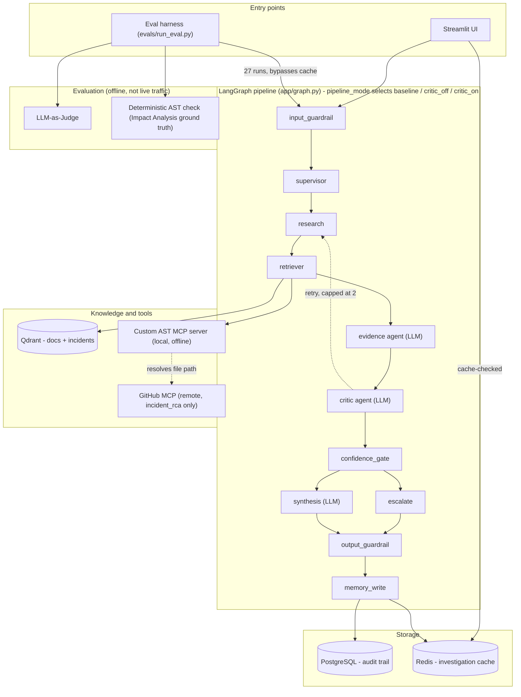

# AppMind — Detailed Flow Diagram

Node-by-node view of the LangGraph pipeline: exact routing, the `pipeline_mode` fork, the Critic retry loop, and the AST→GitHub tool-call sequencing. For the simplified component-category view, see [`documentation.md` §3](documentation.md#3-system-design--architecture).

### Component diagram

*Solid arrows are direct calls; dotted arrows are the retry loop and the AST→GitHub file-path handoff. The Evaluation subgraph is offline tooling — it invokes the pipeline the same way the UI does, but is never part of a live request.*