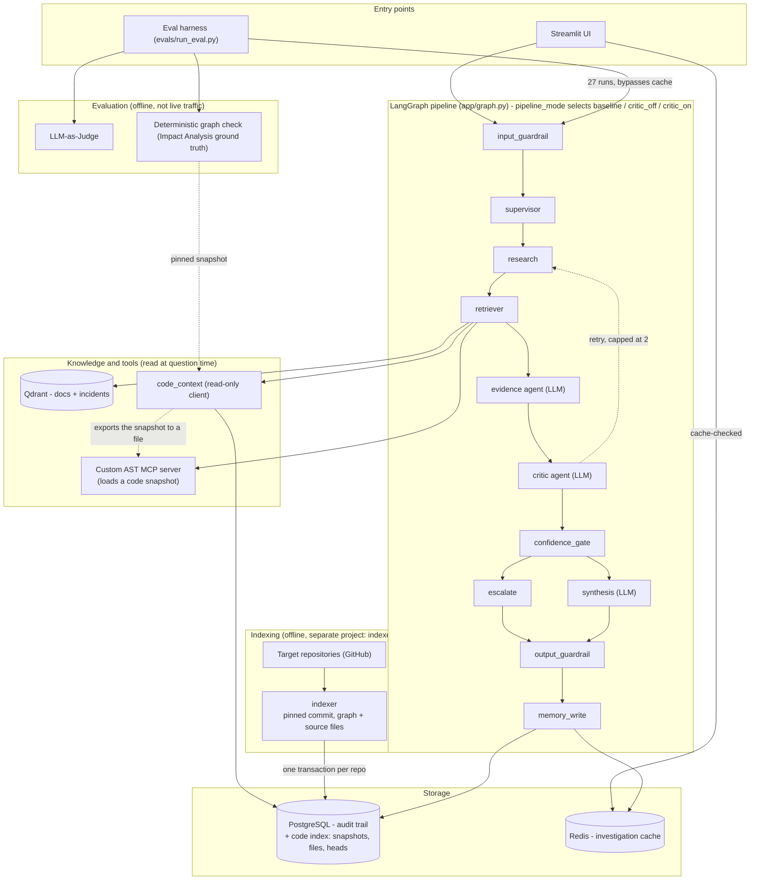

# AppMind — Detailed Flow Diagram

Node-by-node view of the LangGraph pipeline: exact routing, the `pipeline_mode` fork, the Critic retry loop, and how code evidence reaches the retriever from the code index. For the simplified component-category view, see [`detailed-design.md` §3](detailed-design.md#3-system-design--architecture).

### Component diagram

*Solid arrows are direct calls; dotted arrows are the retry loop and the snapshot hand-off to the AST server. Answering a question never contacts GitHub: the indexer (offline, run on demand or on a schedule) reads each repository once at a pinned commit and stores the result, and the retriever reads only that store. The Indexing and Evaluation subgraphs are offline tooling, never part of a live request; evaluation invokes the pipeline the same way the UI does.*
