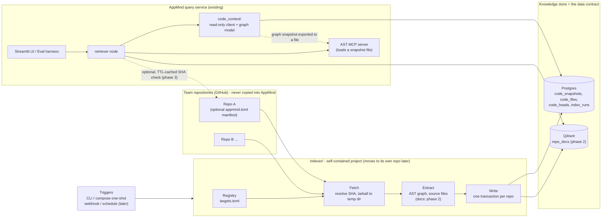

# Feature design: Code Knowledge Index

**Status:** Phase 0 and Phase 1 implemented; Phases 2–4 proposed (see §10 for what was built and where it deviated) · **Scope:** replace the local `orderflow-app/` checkout with an index-time knowledge store so AppMind can support any team's repositories without copying them into this repo. The indexer is built as a **self-contained project** so it can later move to its own repository without code changes.

---

## 1. Problem Statement

AppMind answers questions about an application using three kinds of evidence: documentation, incident reports, and **code**. The code evidence comes from two places today:

- A **local checkout** of the target repo (`orderflow-app/`), parsed by the custom AST MCP server to build the dependency and call graph (impact analysis, and file resolution for incident/RCA).
- The **remote GitHub MCP server**, which fetches real file text for citations on incident/RCA questions.

The local checkout is the problem. AppMind is meant to become a platform that supports many teams' applications and services, each in its own repository. Copying every service into the AppMind repo cannot scale, goes stale the moment the source changes, and breaks access boundaries between teams.

The goal: **remove the dependency on a local checkout, keep the deterministic code answers (dependents, callers, file:line citations), and make the design extensible to multiple repositories** — without adding network hops to the question-answering path.

---

## 2. Current Challenges

| # | Challenge | Evidence in the code |
|---|---|---|
| 1 | **Code must be on local disk.** The AST server only analyzes a directory. | `mcp_servers/ast_graph.py:42` (`DEFAULT_ROOT = .../orderflow-app`); `mcp_clients/ast_client.py:29-33` spawns the server with no root, so the default is used |
| 2 | **Single-repo assumption.** One target repo, one path layout. | `mcp_clients/github_client.py:49-56` reads a single `GITHUB_TARGET_REPO`; module names are derived from root-relative paths and assume absolute `app.*` imports (`ast_graph.py` docstring, `_module_name`) |
| 3 | **A checkout is fragile.** A manual migration silently dropped it and broke two capabilities at once. | `FAILURES.md` #20 |
| 4 | **Network hops multiply on the hot path.** Each question pays for an AST subprocess spawn (~0.9s, `FAILURES.md` known limitations) and, for incident/RCA, a GitHub round-trip per file (cap of 3). The Critic retry loop re-runs retrieval, so a question with 2 retries pays this 3 times (the INC-1001 demo took ~23s, `TASKS.md`). | `app/retrieval.py:124`, `mcp_clients/github_client.py:90` |
| 5 | **Eval determinism depends on mutable code.** Ground truth is computed from whatever is on disk. | `evals/run_eval.py:75,81` call `build_ast_graph()` on the default root |
| 6 | **Not deployable as a platform.** The Docker image bakes the clone in via `COPY . .` (not excluded by `.dockerignore`). | `Dockerfile` |
| 7 | **Ingestion cannot hold more than one corpus.** Qdrant point ids are the loop index, so a second source sharing a collection would overwrite the first. | `ingest/run_ingestion.py:132-139` (`id=idx`) |
| 8 | **OrderFlow is hardcoded in several places.** (Resolved by the application profile, [`features/appmind-config/`](../appmind-config/app-config-design.md).) | supervisor keyword → component map in `app/graph.py`; `TOPIC_DESCRIPTION` in `guardrails/input_guardrail.py`; server name/instructions in `mcp_servers/ast_server.py:38-49` |
| 9 | **Extraction and querying are fused in one class**, so the analyzer cannot be separated from the query model. | `mcp_servers/ast_graph.py`: `CodeGraph` holds the build passes (`_index_*`) and the queries (`resolve`, `get_dependents`, `get_callers`) together |

---

## 3. Goals and Non-goals

**Goals**
- No target repo is copied into, or stored in, the AppMind repository.
- No repository access on the question-answering path (the hot path reads only AppMind's own store).
- Deterministic answers stay deterministic: every answer is tied to a commit SHA.
- Works for one repo now (OrderFlow) and extends to many without redesign.
- Keep the MCP tool surface, the grounding check, and the "code is not in the vector store" decision.
- **The indexer is a self-contained project.** It shares no code with AppMind and communicates with it only through a documented data contract, so moving it to its own repository is a relocation, not a refactor.

**Non-goals (this feature)**
- Cross-service call graphs from runtime traffic (HTTP/gRPC/queues). The import/call graph is per repo; cross-repo edges are a later extension (API specs, service catalog).
- Extractors for languages other than Python.
- Persona-aware answering (product / developer / operations).
- Replacing the docs/incidents corpus with connectors (noted in §8).
- Performing the repository split itself. It is Phase 4 (§7); Phases 1–3 only guarantee the structure that makes it cheap.

---

## 4. Proposed Solution

### 4.1 Idea

**Index ahead of time; read from the store at query time.** A separate **indexer** fetches a repo once (pinned to a commit SHA), runs the AST analysis, and writes the derived knowledge — the dependency/call graph and the source files used for citations (docs and specs from Phase 2) — into AppMind's stores (Postgres, and Qdrant for docs), each tagged with `repo`, `sha`, and `indexed_at`. The question-answering app never touches the repo.

The indexer lives in its own top-level folder, `indexer/`. AppMind reads the results through a small read-only package, `code_context/`. The two sides meet only at the data contract (§6.2).

### 4.2 Options considered

| Option | How code reaches the answer | Verdict |
|---|---|---|
| **A. Status quo** | Local checkout on disk | Rejected: does not scale, goes stale, fragile |
| **B. Live remote fetch at query time** | Fetch files (MCP per file, or clone/tarball) on every question | Rejected as default: adds network hops to every question and every retry; needs pinning and layout handling on the hot path; network dependency for impact analysis |
| **C. Index-time knowledge store (chosen)** | Indexer builds graph + files into Postgres; app reads the store | Chosen |
| **D. Push model (CI publishes artifacts)** | Each team's CI posts graph/specs to AppMind | Future option: removes repo credentials from AppMind and handles any language, at the cost of per-team adoption work |

### 4.3 Pros and cons of the chosen option

**Pros**
- Removes repo access from the hot path; latency becomes database reads.
- Determinism: an answer cites `repo@sha`; evals pin a snapshot.
- Layout and source-root handling is configured once per repo at index time.
- Nothing from any target repo lives in the AppMind git repository.
- Reuses what exists: the AST analysis logic, the MCP server and tools, the grounding check, and the `memory/db.py` conventions.
- Scales to more repos by adding registry entries, not code.
- A hard boundary between the indexer and AppMind makes the later repository split mechanical.

**Cons / costs**
- **Staleness window** between a push and the next index run. Mitigated with SHA tagging, "as of" visibility, event-driven refresh later, and an optional freshness check.
- **New moving parts:** an indexer, a schema, and a trigger mechanism.
- **Deliberate duplication** across the boundary: small dataclasses and (in Phase 2) a markdown chunker exist on both sides, because sharing code would defeat the separation. The data contract plus contract tests keep the copies honest.
- **Permissions:** reading a repo live enforces repo access for free; a central store must replicate access rules (needs an owners/ACL field in the registry before it serves multiple teams).
- **Python only** for the AST extractor today.
- Storage grows with snapshots (bounded by retention).

---

## 5. High-Level Design

### 5.1 Architecture



### 5.2 Components

| Component | Responsibility |
|---|---|
| **`indexer/` (project)** | A self-contained batch job with its own Dockerfile, requirements, config, tests, README and contract document. It imports nothing from AppMind. Internally: **Registry** (what to index), **Fetch** (resolve `ref` to a SHA, download a tarball to a temp dir), **Extract** (run the AST analysis, collect source files; docs in Phase 2), **Write** (persist one repo in one transaction, then delete the temp dir). It owns and creates the database schema. |
| **Registry** | The list of repos to index: repo, ref, source root, doc globs, exclusions. Phase 1 is `indexer/targets.toml` (identifiers only, no repo content). Phase 2 moves to a Postgres table with owners and manifest discovery. |
| **Manifest** (`appmind.toml`, in the *team's* repo) | Lets a repo describe itself: source root, language, docs paths, owners. Teams own their own config; it fixes the `src/` vs `app/` layout problem. Optional in Phase 1. |
| **Knowledge store — Postgres** | `code_snapshots` (graph as JSONB, SHA-pinned), `code_files` (source text for citations), `code_heads` (current snapshot per repo), `index_runs` (audit trail). This is the contract surface. |
| **Knowledge store — Qdrant** | Phase 2: docs/specs/ADRs/READMEs from repos in a **separate `repo_docs` collection** owned by the indexer, with `repo` and `sha` in the payload. Code itself stays out of the vector store. |
| **`code_context/` (AppMind)** | The only AppMind code that knows about the contract: read-only SQL access to the snapshot tables, plus the query-side graph model (`from_dict`, `resolve`, `get_dependents`, `get_callers`, `list_components`). Checks the snapshot's `schema_version`. |
| **AST MCP server** | Same three tools, but it loads a snapshot file instead of parsing a directory. |
| **Retriever** | Resolves the target repo's head snapshot via `code_context`, calls the AST server, and reads cited files from the store instead of calling GitHub. |
| **Freshness check** (optional, Phase 3) | One cheap call comparing the head SHA with the repo's current SHA, cached with a TTL and failing open. When behind, the answer says so. |
| **Triggers** | Phase 1: a CLI command and a one-shot compose service. Later: push webhook and a scheduled SHA-compare (skip unchanged repos). |

### 5.3 Flows

**Indexing (per repo):** registry entry → resolve SHA → skip if `(repo, sha, extractor_version)` already indexed → download tarball to temp dir → AST graph + files → one transaction into Postgres → move `code_heads` pointer → delete temp dir.

**Question answering:** question → `retriever` → head snapshot for the target repo (`code_context`) → AST server over the exported snapshot → cited files read from `code_files` → evidence → Critic → answer. No repository is contacted. Citations show `repo@sha`.

### 5.4 Key decisions

1. **Per-repo atomic snapshots.** A failed run never leaves a half-updated repo; the previous head keeps serving.
2. **Graph stored as a JSONB snapshot, queried by Python on the AppMind side.** The existing BFS logic is reused. Normalized tables are deferred until cross-repo queries need them.
3. **The indexer uses plain GitHub REST, not MCP.** It is a batch job where one tarball call beats per-file tool calls, and read-only PAT scoping still applies. The question-answering path no longer touches GitHub, so the old "code access through MCP" rationale applies to a path that no longer exists. The GitHub MCP client stays as an optional live fallback.
4. **The AST server receives a snapshot file, not database credentials.** See §6.5.
5. **The indexer is a self-contained project; AppMind reads through a data contract only.** No imports in either direction, enforced by a boundary test (§6.10) and by building the indexer image from `./indexer` alone (§6.7).

### 5.5 Storage choice: SQL vs NoSQL

**Decision:** Postgres (relational tables plus JSONB) for the code graph, source files, pointers and audit; Qdrant for docs and specs. No new datastore.

**What is stored, and in which format**

| Knowledge | Format | Store |
|---|---|---|
| Dependency and call graph | JSON document (schema in §6.2): `symbols`, `imports`, `calls`, plus `schema_version`, `repo`, `sha` | Postgres, `code_snapshots.graph` (JSONB) |
| Source files | Plain text rows (`path`, `language`, `size_bytes`, `content`), kept verbatim because the Evidence agent checks quotes against the exact text | Postgres, `code_files` |
| Docs, specs, ADRs (Phase 2) | Text chunks with embeddings and a `{repo, sha, path}` payload | Qdrant, `repo_docs` |
| Current-snapshot pointer, indexing audit | Relational rows | Postgres, `code_heads`, `index_runs` |

Every row is tied to a commit SHA, so each answer can name the version of the code it came from.

**Why Postgres fits**
- **Access pattern.** Look up by `(repo, sha)`, fetch files by path, load one repo's graph and traverse it in Python. These are key lookups plus one small document, not heavy graph queries inside the database.
- **Atomic snapshots.** A repo is written in one transaction and the head pointer is switched. A failed run leaves the previous snapshot serving. This is where SQL transactions help most.
- **No new infrastructure.** Postgres and Qdrant already run.
- **Flexible schema where it's needed.** JSONB gives the graph a document-store's flexibility, with `schema_version` handling evolution.

**When another store would earn its place**

| Store | Revisit when |
|---|---|
| Graph database (e.g. Neo4j) | Multi-hop queries across many repos are a real requirement ("what is affected across all services"). Today the graph is per repo and small, and the tested Python traversal is enough. |
| Document store (e.g. MongoDB) | Rarely. It would hold the same JSON as JSONB with no real gain. |
| Object storage (e.g. S3) | Source files or snapshots grow too large for comfortable storage in Postgres. |
| Vector database | Already used for docs. It is the wrong place for code facts such as dependents, which must be exact. |

**Caveat and triggers.** Loading a whole graph per question gets costly on very large repos. Caching the loaded graph per snapshot id (and the exported snapshot file) softens this. Revisit the choice when a *measured* trigger appears: hydration latency for the largest repo exceeds the latency budget even with caching, cross-repo multi-hop queries are needed, or stored files outgrow the database. The first remedy is normalizing the graph into tables; a graph database comes after that.

### 5.6 Repository boundary: built to be split

The indexer will move to its own repository later. To make that a relocation, the boundary is built in Phase 1, not retrofitted.

- **Two folders, one direction of knowledge.** `indexer/` (moves) and `code_context/` (stays) never import each other. `indexer/` imports no AppMind package; AppMind imports nothing from `indexer/`.
- **The contract is the data.** The Postgres schema, the graph JSON schema with `schema_version` / `extractor_version`, and (Phase 2) the `repo_docs` payload are documented in `indexer/CONTRACT.md`, which moves with the indexer.
- **The indexer owns the schema and the writes.** AppMind only reads, and tolerates the tables not existing yet.
- **Separate build artifacts.** The indexer has its own `Dockerfile` and `requirements.txt`; its image is built from `./indexer` alone, so an accidental AppMind import fails at build or run time. AppMind's `.dockerignore` excludes `indexer/`.
- **Deliberate duplication** of small dataclasses and the Phase 2 markdown chunker, instead of a shared library.
- **Enforced, not hoped for.** A boundary test scans imports on both sides (§6.10).
- **Version handshake.** `code_context` refuses or flags a snapshot whose `schema_version` it does not support, so the two repositories can release independently.
- **The split itself** is Phase 4 (§7).

---

## 6. Low-Level Design

### 6.1 Layout

```
indexer/                              # project root: becomes the new repo root
├── README.md                         # standalone docs: what it is, env vars, how to run
├── CONTRACT.md                       # the interface with AppMind (see 6.2)
├── Dockerfile                        # own image; contains no AppMind code
├── requirements.txt                  # own dependencies only
├── targets.toml                      # registry (phase 1)
├── appmind_indexer/                  # importable package (name stays the same after the move)
│   ├── config.py                     # env-driven settings (its own copy of the conventions)
│   ├── registry.py                   # Target dataclass, load_targets() via stdlib tomllib
│   ├── fetch.py                      # resolve_sha(), download_tarball() with safe extraction
│   ├── extract/
│   │   ├── python_ast.py             # graph extraction (ported from mcp_servers/ast_graph.py)
│   │   └── files.py                  # source-file collection (docs collection: phase 2)
│   ├── store.py                      # schema DDL + all WRITES (owner of the schema)
│   ├── docs_index.py                 # phase 2: chunk + embed + upsert into repo_docs (own chunker)
│   └── run.py                        # CLI
└── tests/
    ├── fixtures/                     # sample source tree for extractor tests (moves with the indexer)
    └── test_*.py                     # runnable standalone from indexer/

code_context/                         # AppMind side: the only consumer of the contract
├── contract.py                       # SUPPORTED_SCHEMA_VERSIONS, table/column names
├── snapshots.py                      # READ-ONLY: get_head(), get_files(), export_graph_file(), load_graph()
├── graph.py                          # query-side CodeGraph: from_dict, resolve, get_dependents, get_callers, list_components
└── test_boundaries.py                # import-boundary test (6.10)
```

`mcp_servers/ast_graph.py` is **deleted**: its build passes move to `indexer/appmind_indexer/extract/python_ast.py` and its query methods move to `code_context/graph.py`. Run the indexer locally with `cd indexer && python -m appmind_indexer.run`.

`EXTRACTOR_VERSION = "ast-1"` (in the indexer) is part of the snapshot key; bumping it re-indexes everything when the analyzer changes.

### 6.2 Interface contract (owned by the indexer; documented in `indexer/CONTRACT.md`)

**A. Postgres tables.** Created by the indexer; AppMind only reads them.

```sql
CREATE TABLE IF NOT EXISTS code_snapshots (
    id                UUID PRIMARY KEY,
    repo              TEXT NOT NULL,              -- "owner/name"
    ref               TEXT NOT NULL,              -- branch/tag requested
    sha               TEXT NOT NULL,              -- resolved commit: the pin
    source_root       TEXT NOT NULL DEFAULT '.',
    extractor_version TEXT NOT NULL,
    schema_version    INTEGER NOT NULL,           -- version of the graph JSON schema (B)
    graph             JSONB NOT NULL,
    stats             JSONB NOT NULL,             -- files, symbols, call edges, doc chunks
    pinned            BOOLEAN NOT NULL DEFAULT false,   -- exempt from pruning (eval snapshots)
    indexed_at        TIMESTAMPTZ NOT NULL DEFAULT now(),
    UNIQUE (repo, sha, extractor_version)
);

CREATE TABLE IF NOT EXISTS code_files (
    snapshot_id UUID NOT NULL REFERENCES code_snapshots(id) ON DELETE CASCADE,
    path        TEXT NOT NULL,                    -- repo-root-relative, posix
    language    TEXT,
    size_bytes  INTEGER NOT NULL,
    content     TEXT NOT NULL,
    PRIMARY KEY (snapshot_id, path)
);

CREATE TABLE IF NOT EXISTS code_heads (
    repo        TEXT PRIMARY KEY,
    snapshot_id UUID NOT NULL REFERENCES code_snapshots(id),
    updated_at  TIMESTAMPTZ NOT NULL DEFAULT now()
);

CREATE TABLE IF NOT EXISTS index_runs (
    id          UUID PRIMARY KEY,
    repo        TEXT NOT NULL,
    sha         TEXT,
    trigger     TEXT NOT NULL,                    -- cli | compose | webhook | schedule
    status      TEXT NOT NULL,                    -- running | succeeded | skipped | failed
    error       TEXT,
    started_at  TIMESTAMPTZ NOT NULL DEFAULT now(),
    finished_at TIMESTAMPTZ
);
```

Retention: the indexer keeps the latest N snapshots per repo (default 5) plus any `pinned` snapshot.

**B. Graph JSON schema, version 1** (`code_snapshots.graph`). Lossless, so the query side can rebuild the full graph from it. All file paths are repo-root-relative (the extractor prefixes `source_root`).

```json
{
  "schema_version": 1, "repo": "owner/name", "sha": "<commit>", "extractor_version": "ast-1",
  "modules": ["app.payment_client", "..."],
  "symbols": { "<qualname>": {"kind": "module|class|function", "module": "...", "file": "...", "line": 12, "parent": "<qualname>|null"} },
  "imports": { "<importer module>": { "<imported module>": {"symbols": ["..."], "wholesale": false, "line": 3} } },
  "calls":   [ {"caller": "<qualname>", "target": "<qualname>", "file": "...", "line": 40} ]
}
```

**C. Qdrant `repo_docs` (Phase 2).** A collection owned exclusively by the indexer: payload `{repo, sha, path, source, heading, text}`; point ids are stable `uuid5` over `repo:path:heading`; embeddings use the same model and size AppMind queries with (`text-embedding-3-small`, 1536, cosine). The indexer deletes a repo's points for older SHAs by filter.

**D. Versioning rules.** Additive changes (new optional fields) keep `schema_version`. A breaking change bumps it. `code_context` declares `SUPPORTED_SCHEMA_VERSIONS` and records a retrieval error for any other version rather than misreading it.

**E. Ownership and access.** The indexer owns the DDL and every write. AppMind runs `SELECT` only and treats a missing table as "no snapshot yet". In Phase 1 both use the existing `appmind` database user; a read-only role for AppMind is added when the split happens (Phase 4).

### 6.3 Indexer internals (per target; one failing target does not stop the others)

1. `ensure_schema()`, then insert an `index_runs` row (`running`).
2. `sha = resolve_sha(repo, ref)` via GitHub REST (`GET /repos/{owner}/{repo}/commits/{ref}`).
3. If `(repo, sha, EXTRACTOR_VERSION)` exists and not `--force`: ensure `code_heads` points at it, mark `skipped`, stop.
4. Download the tarball (`GET /repos/{owner}/{repo}/tarball/{sha}`) into a `TemporaryDirectory` with a size cap; extract safely (reject absolute paths, `..`, links escaping the target).
5. Run the extractor on `root/source_root`: build the graph and serialize it to schema v1.
6. Collect `.py` files (skip `__pycache__`, apply `exclude`, cap each file's size).
7. **One transaction:** insert the snapshot, bulk-insert files, upsert `code_heads`.
8. *(Phase 2)* chunk docs with the indexer's own chunker, embed in one batch, upsert into `repo_docs`, delete that repo's older-SHA points.
9. Prune old snapshots; mark the run `succeeded` (or `failed` with the error, leaving the previous head untouched). The temp dir is deleted either way.

The CLI is `python -m appmind_indexer.run [--repo owner/name] [--force] [--pin]`. It exits non-zero on failure: a batch job may fail loudly; the query path may not.

### 6.4 AppMind-side changes

| File | Change |
|---|---|
| `code_context/` (new) | Contract constants, read-only `snapshots.py`, and the query-side `graph.py` (see 6.1). `snapshots.load_graph(snapshot_id)` returns a hydrated graph, cached per snapshot id. |
| `mcp_servers/ast_graph.py` | **Delete.** Extraction moved to the indexer; queries moved to `code_context/graph.py`. |
| `mcp_servers/ast_server.py` | Import the graph from `code_context.graph`. Replace `--root` with `--snapshot FILE` (parsing code no longer lives in AppMind). Generic server name and instructions (no "OrderFlow"). |
| `mcp_clients/ast_client.py` | Build `StdioServerParameters` at call time: `snapshots.get_head(repo)`, `snapshots.export_graph_file(snapshot_id)`, then spawn `python -m mcp_servers.ast_server --snapshot <file>`. Keep an override seam so the existing error-handling tests can still swap in a dead server. `ASTLookupResult` carries snapshot metadata (repo, sha, indexed_at). |
| `app/retrieval.py` | `_search_source_code` reads `snapshots.get_files(snapshot_id, paths)` instead of `github_client.fetch_source_files`. The 3-file cap moves here. Chunks use `source="<repo>@<sha7>"`, `location=<path>`, so the UI citation shows the snapshot. Store errors are recorded in `retrieval_errors` per the existing never-raise convention (§6.8). The target repo comes from `APPMIND_CODE_REPO` (Phase 2 resolves it from the component). |
| `mcp_clients/github_client.py` | Unchanged; kept as an optional live fallback, no longer on the default path. Its tests stay valid. |
| `app/graph.py` | Retriever node logs `[code-index] repo@sha7 indexed_at=...`. Phase 2: remove the hardcoded component keywords. |
| `evals/run_eval.py` | Replace `build_ast_graph()` (`:75,81`) with `snapshots.load_graph(snapshot_id)`, snapshot chosen by `APPMIND_EVAL_SNAPSHOT` (a pinned SHA). The summary header records `repo@sha`. |
| `ingest/run_ingestion.py` | **Unchanged in this feature.** It keeps owning the `docs` and `incidents` collections for the local corpus; the indexer writes its own `repo_docs`, which resolves challenge #7 without touching this module. |
| `rag/search.py` | Phase 2: add `repo_docs` to the searched collections and top-k policy, plus an optional `repo` filter. |
| `.dockerignore`, `.gitignore` | `.dockerignore`: add `indexer/` and `.cache/`. `.gitignore`: remove `orderflow-app/*` once the folder is gone; add `.cache/`. |
| `docker-compose.yml` | Add a one-shot `indexer` service (§6.7). |
| `requirements.txt` (AppMind) | No new dependencies. The indexer's dependencies live in `indexer/requirements.txt`. |
| Docs | README (components table: `indexer/`, `code_context/`), `CLAUDE.md`, `TASKS.md`, `docs/detailed-design.md` (Sources table, "Local AST checkout" trade-off, §3 Components), `docs/problem-definition-data-processing-evaluation.md`. `FAILURES.md` #20 stays as history. |

### 6.5 Why the AST server gets a file, not Postgres credentials

The AST server runs as an MCP stdio subprocess. The MCP SDK starts such a child with a restricted default environment unless `env` is passed explicitly (to be verified against `mcp==2.2.0`), so the child would not see `POSTGRES_*` in the containerized app. Rather than forward database credentials into the child, the client (which already has DB access) exports the snapshot's `graph` JSONB to `.cache/snapshots/<snapshot_id>.json` once (snapshot ids are immutable, so the file is reusable) and passes `--snapshot`. Side benefits: least privilege for the child, and tests can run the server against a small JSON file with no database.

### 6.6 Registry and manifest

`indexer/targets.toml` (inside the AppMind repo this file is generated from the application profile by `python -m app_profile.export_targets` and git-ignored; `indexer/targets.example.toml` is the committed example; identifiers only):

```toml
[[target]]
repo        = "PrabuRepo/orderflow-app"   # example; update with the final account name
ref         = "main"
source_root = "."
exclude     = ["**/tests/**"]
# docs = ["README.md", "docs/**/*.md"]    # enabled in phase 2
```

Optional manifest in the target repo (`appmind.toml`), read by the indexer in Phase 2 and merged over registry defaults:

```toml
source_root = "src"
language    = "python"
docs        = ["docs/**/*.md", "specs/**/*.md"]
owners      = ["team-payments"]
```

Authentication in Phase 1 uses a fine-grained, read-only `GITHUB_TOKEN`. Phase 3 moves to a GitHub App (short-lived installation tokens, per-org install, push webhooks) instead of a personal token.

### 6.7 Docker

The indexer builds from its own folder, so its image contains no AppMind code:

```dockerfile
# indexer/Dockerfile
FROM python:3.13-slim
ENV PYTHONUNBUFFERED=1
WORKDIR /app
COPY requirements.txt .
RUN pip install --no-cache-dir -r requirements.txt
COPY . .
ENTRYPOINT ["python", "-m", "appmind_indexer.run"]
```

```yaml
# docker-compose.yml (excerpt)
indexer:
  build: ./indexer
  restart: "no"
  depends_on: [postgres]
  environment:
    POSTGRES_HOST: postgres
    GITHUB_TOKEN: ${GITHUB_TOKEN}
```

Because the indexer is a separate image with its own `ENTRYPOINT`, the entrypoint-override workaround the shared AppMind `Dockerfile` would have needed disappears. The indexer receives only the variables it needs (compose substitutes `${GITHUB_TOKEN}` from the project `.env`), not the whole `.env`. In Phase 2 it additionally gets `QDRANT_URL` and `OPENAI_API_KEY`.

`docker compose up` runs it once and it exits; the `app` service does **not** wait on it (it starts regardless, and code evidence appears once the first snapshot lands). Manual refresh: `docker compose run --rm indexer`. Keeping the indexer out of the app's startup path means indexing many repos can never delay the UI.

### 6.8 Error handling

The query path keeps the project's never-raise convention: store failures become `retrieval_errors` entries, which cap confidence and lead to an honest escalation.

| Situation | Behavior |
|---|---|
| Postgres unreachable | `retrieval_errors`: "code index unavailable: ..."; RAG evidence still flows |
| Snapshot tables don't exist (indexer never ran) | Treated as "no snapshot yet" (below) |
| No head snapshot for the repo | `retrieval_errors`: "no code snapshot for `<repo>` — run the indexer" |
| Unsupported `schema_version` | `retrieval_errors`: names the version and the supported set; no misreading |
| Snapshot file missing or corrupt | Re-export once from Postgres; if it still fails, record the error |
| No component named in the question | Not an error (unchanged from today) |
| Snapshot older than a configurable age | Note on the evidence, not an error |
| Indexer fails mid-run | Transaction rolled back; the previous head keeps serving; `index_runs` records the failure |

### 6.9 Observability

The indexer logs stage by stage (`[index] repo sha fetch/extract/write`, counts, durations) and writes `index_runs`. The query path logs the snapshot used (`[code-index] repo@sha7 indexed_at=...`); the existing `[trace]` line is unchanged.

### 6.10 Test plan

- **Indexer tests** (`indexer/tests/`, runnable standalone from `indexer/`, real Postgres container per project convention): the extractor on the fixture source tree; `store` write, skip-if-unchanged, rollback on failure, prune; safe tarball extraction (traversal rejected); the output validates against schema v1.
- **AppMind tests:** the existing 14 AST server checks run against a small checked-in graph JSON (`--snapshot`), produced once by the indexer's extractor from a pinned SHA. `code_context` tests cover hydration, caching, missing tables, and an unsupported `schema_version`.
- **Boundary test** (`code_context/test_boundaries.py`): parse every Python file with `ast`; fail if any AppMind package imports `appmind_indexer`, or if any file under `indexer/` imports an AppMind package (`app`, `agents`, `rag`, `memory`, `mcp_servers`, `mcp_clients`, `guardrails`, `ingest`, `evals`, `llm_as_judge`, `ui`, `code_context`).
- **Parity check (one-off, before deleting the old code and folder):** for **every** component in the local build, `get_dependents` and `get_callers` from the old `ast_graph` equal the output of extractor → JSON → `code_context.graph`.
- **Fault injection:** extend the existing error-handling cases with Postgres down, empty index, missing tables, corrupt snapshot, and unsupported schema version.
- **Eval:** full 27-run harness on a pinned snapshot; compare against the last run, allowing for the known single-trial variance.

---

## 7. Implementation Plan

**Phase 0 — Spike (S).** Verify before building: the GitHub tarball and commit-SHA endpoints work with the fine-grained PAT (including the redirect); the MCP child's environment behavior; the graph round trip. Confirm the names (`indexer/`, `appmind_indexer`, `code_context/`). *Exit:* all confirmed or the design adjusted.

**Phase 1 — Single repo, remove the local checkout (M).**

- **1A — Build `indexer/` as a self-contained project.** Scaffolding (README, `CONTRACT.md`, Dockerfile, requirements, config); port the extraction passes from `ast_graph.py` into `extract/python_ast.py` and emit schema v1; fetch; store (DDL and writes); CLI; fixture tree and tests. *Exit:* the image builds from `./indexer` alone, indexes OrderFlow into Postgres, and the parity check passes against the old graph.
- **1B — AppMind read side.** `code_context/` (contract constants, graph model, read-only snapshots), `ast_server --snapshot`, switch `ast_client.py`, `retrieval.py` and `evals/run_eval.py`, delete `mcp_servers/ast_graph.py`, update tests, add the boundary test. *Exit:* all existing checks pass on the JSON fixture, the boundary test passes, and the fault drills pass.
- **1C — Cutover.** Compose service, delete `orderflow-app/`, update ignore files and docs, run the pinned-snapshot eval. *Exit:* §9 acceptance criteria met.

**Phase 2 — Multi-repo and docs (M).** Registry in Postgres with owners; manifest discovery; docs indexing into `repo_docs` plus retrieval of it (`rag/search.py` top-k policy); `repo` parameter on the AST tools and component-to-repo resolution; replace the hardcoded supervisor keywords and the OrderFlow-specific topic description with per-target data. *Exit:* two registered repos answered correctly without code changes.

**Phase 3 — Automation and platform (M–L).** GitHub App authentication; push webhook and scheduled SHA-compare refresh; TTL-cached freshness check surfaced in answers; retention policy; permissions model; push-model artifacts; additional language extractors.

**Phase 4 — Split the indexer into its own repository (S–M, when you choose).** Because Phases 1–3 kept the boundary, this requires no code changes on either side:
1. Create the new repository from `indexer/` with history preserved (`git filter-repo --subdirectory-filter indexer`, or `git subtree split --prefix=indexer`).
2. Add CI to the new repo: run its tests, build and publish the image.
3. In AppMind, replace `build: ./indexer` with the published image in `docker-compose.yml`; delete `indexer/`; drop its `.dockerignore` entry and the indexer side of the boundary test.
4. Database roles: the indexer gets a write-capable role, AppMind a read-only one.
5. Pin the contract version in both READMEs; keep the contract fixture and `code_context` tests in AppMind, and the schema tests in the indexer repo.
*Exit:* AppMind builds and answers with no `indexer/` folder, and the new repo's CI is green.

---

## 8. Risks, Trade-offs, and Open Decisions

| Risk / trade-off | Mitigation |
|---|---|
| Stale index | SHA in every citation; refresh trigger; optional freshness check; surface "behind HEAD" in the answer |
| Permissions across teams | Owners field in the registry before serving multiple teams; enforce at query time (Phase 3) |
| Large repos | Size caps on tarball and files; per-file exclusions; stats in `index_runs` |
| Tarball extraction safety | Reject traversal and external links; temp dir only; token never logged |
| Static analysis limits | Unchanged and documented: no inheritance/MRO, no dynamic dispatch, within-repo only |
| Graph in JSONB may not suit cross-repo queries | Normalize into tables in Phase 2 only if needed |
| Duplication across the boundary (dataclasses, chunker) | Accepted deliberately; the contract document, schema version, and contract tests keep both sides aligned |
| Boundary erodes over time | The boundary test fails the build on any cross-import; separate image build context |
| Porting the extractor changes behavior | The all-components parity check must pass before the old code is deleted |

**Decisions to confirm**

1. **Names:** project folder `indexer/`, package `appmind_indexer`, AppMind-side package `code_context/`.
2. **Test fixture:** a small graph JSON checked into AppMind's tests, plus a fixture source tree inside `indexer/tests/` (recommended), versus fetching at test time (network-dependent).
3. **Indexer fetch method:** REST tarball (recommended: one call, no `git` binary needed in the image), versus GitHub MCP file-by-file.
4. **Indexer in `docker compose up`:** one-shot, non-blocking (recommended), versus blocking `app` until it finishes.
5. **Auth timing:** keep the fine-grained PAT through Phase 2, move to a GitHub App in Phase 3.
6. **Docs corpus:** keep OrderFlow's own `knowledge-domains/` local for now; in the platform, docs and incidents come from repos and connectors, using the same snapshot pattern.
7. **Docs indexing timing:** Phase 2 (recommended, keeps Phase 1 to graph and files), versus including it in Phase 1.

---

## 9. Acceptance Criteria

- On clean volumes with `orderflow-app/` absent, `docker compose up --build -d` indexes the registered repo, and the INC-1001 question cites `payment_client.py` with `repo@sha7` and `grounded=True`.
- Parity: for every component, `get_dependents` and `get_callers` from the snapshot equal the old local build at the same commit.
- **Boundary:** the boundary test passes; `docker build ./indexer` succeeds using only the `indexer/` folder as context; the indexer's tests run standalone from `indexer/`; `mcp_servers/ast_graph.py` no longer exists.
- A pinned-snapshot eval run completes all 27 runs with Impact Analysis recall unchanged and no new retrieval or agent errors.
- The code-lookup portion of a question no longer includes any GitHub round trip; before/after latency is recorded in `TASKS.md`.
- Fault drills (Postgres down, empty index, missing tables, corrupt snapshot, unsupported schema version) end in an honest escalation, never a crash.
- `orderflow-app/` is deleted, and a search for `orderflow-app` in source code returns only historical documentation.

---

## 10. Implementation Status (Phase 1)

Phases 0 and 1 are implemented. Full verification detail, measurements, and
the list of deviations live in `TASKS.md` (Decisions log, "Code knowledge index
(Phase 1)"). Acceptance criteria from §9:

| Criterion | Status |
|---|---|
| Indexes the registered repo and the INC-1001 question cites `payment_client.py` with `repo@sha7`, `grounded=True`, with `orderflow-app/` absent | Done, verified through the containerized UI. Checked on the existing volumes; a run from clean volumes (`docker compose down -v`, which also wipes the local audit trail) has not been done |
| Parity: every component's `get_dependents` / `get_callers` equals the old build | Done: 116 results across all 29 components, both transitive modes, identical |
| Boundary test passes; `docker build ./indexer` uses only that folder; the indexer's tests run standalone; `ast_graph.py` is gone | Done (the boundary test was also proven to fail on planted violations) |
| A pinned-snapshot eval run completes all 27 runs with Impact Analysis recall unchanged | **Not done**: only the ground-truth path was exercised (no LLM cost). The pinning mechanism (`APPMIND_EVAL_SNAPSHOT`) is in place |
| The code-lookup portion no longer includes a GitHub round trip; before/after latency recorded | Done: reading a cited file ~1,315 ms to ~22 ms. The AST lookup is unchanged (~1.36 s, dominated by spawning the MCP subprocess) |
| Fault drills end in an honest escalation, never a crash | Done: Postgres unreachable, missing tables, no snapshot, unsupported schema version, corrupt cached snapshot file, and the dead/hung AST server cases |
| `orderflow-app/` deleted; source search returns only historical documentation | Done |

Where the implementation differs from the plan above: the AST server's `--root`
option was removed outright (parsing code no longer lives in AppMind) and its
tests run on a checked-in graph snapshot, `code_context/fixtures/orderflow_graph.json`;
docs/specs indexing and `repo_docs` remain in Phase 2; and the GitHub MCP client
was kept but is no longer called on the default path.
